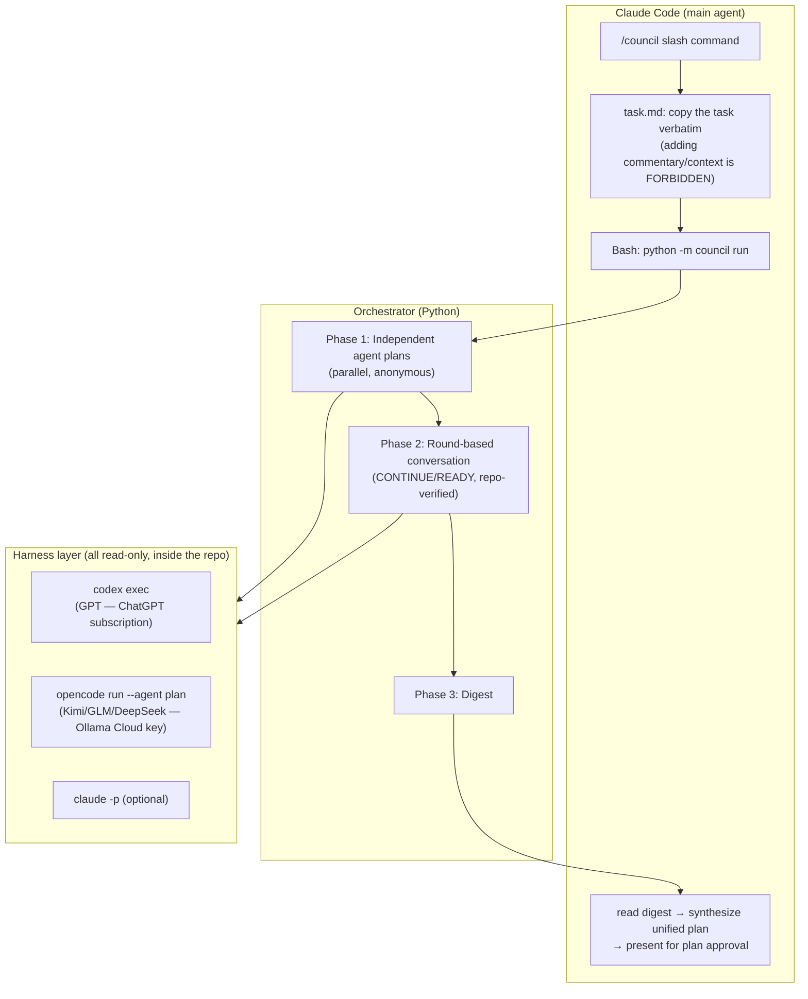

# Plan Council — Design Document (V2 — zero-steering revision)

> **ARCHIVED — V2.** Superseded by [web-control-plane-design.md](web-control-plane-design.md).
>
> Kept for the reasoning behind the debate protocol itself — phases, anonymity,
> envelopes, budgets — which is unchanged. Everything else here describes a
> program that no longer exists: the command names, the directory layout, the
> "no framework, ~200 lines" architecture and the roadmap are all V2.

> A multi-model plan maturation system: an orchestrator triggered from within Claude Code,
> where multiple models first **explore the repo themselves** to produce independent plans,
> then mature the plan by chatting with each other, and decide on maturity themselves.
>
> **Scope:** This document defines the blueprint and the technology decisions.
> Development is the next step.
>
> **Changed in V2:** The "Claude writes a brief" approach was removed — it introduced
> steering. All panelists now receive the user's raw task description **verbatim** and
> access everything they need in the repo **themselves**.

---

## 1. Purpose and Design Principles

Automate the workflow Esat currently performs manually: having multiple models
(GPT, Kimi, GLM, DeepSeek, optionally Claude) contribute to a plan, having the models
see and respond to each other's comments (a real conversation), and ending up with
**a single unified plan**.

1. **Zero steering** — the main agent does not prepare a brief/summary/context for the
   panel. The user's task description is passed to the panel unmodified, without
   commentary. This is the only shared starting point.
2. **Full repo access, for every panelist** — each panelist reads whatever it needs in
   the repo itself (read-only). No one is confined to "prepared context"; everyone does
   its own exploration and forms its own assumptions.
3. **Independent start** — no panelist sees another's plan before writing its own
   (prevents anchoring).
4. **A real conversation** — not a single Q&A; panelists continuously evaluate each
   other's comments, raise objections, **verify claims against the repo** when needed,
   and change their minds.
5. **The panel decides on maturity** — no fixed round count; every panelist signals
   "continue / ready" each round, and the conversation ends when everyone is ready
   (with an upper limit as a safety net).
6. **The main agent does the synthesis** — after the conversation ends, Claude Code
   writes the unified plan from the decisions the panel converged on. (Synthesis happens
   *after* the debate, so it is not steering; unresolved points are left to the user in
   a separate section.)
7. **Subscription-compliant access** — GPT is reached via Codex CLI (ChatGPT
   subscription), Claude via `claude -p` (Claude subscription), and Kimi/GLM/DeepSeek
   **through the opencode harness**; opencode connects to Ollama Cloud with your API key
   (details: Section 2). No third-party subscription OAuth is used (ToS-compliant — only
   subscription OAuth was banned; connecting a provider with an API key is allowed).

---

## 2. Key Architectural Decision: Every Panelist Is an Agent (CLI Harness)

A model called through a bare API cannot read files. For every panelist to explore the
repo itself, every panelist must run inside an **agent harness**. Two approaches were
evaluated:

**Option A — Every panelist runs as a headless agent CLI (CHOSEN):**

| Panelist | Harness | Repo access | Auth |
|---|---|---|---|
| GPT | `codex exec` | its own read-only sandbox | ChatGPT subscription |
| Kimi / GLM / DeepSeek | `opencode run --agent plan` | opencode's file tools (the plan agent cannot edit → effectively read-only) | Ollama Cloud **API key** (using API-key providers in opencode is allowed; the ban only covered Claude subscription OAuth) |
| Claude (optional) | `claude -p` | its own tools | Claude subscription |

The orchestrator thus reduces to a pure "CLI conductor": a single uniform adapter
(subprocess: send prompt, read reply from stdout), with all agent complexity (tool loop,
file reading, context management) delegated to mature harnesses. It also ensures
symmetry: **everyone is an agent, no one is a "blind API".**

- Note: with `opencode serve` + `opencode run --attach`, calls can attach to a
  persistent server, avoiding cold-start cost on every call (an important optimization
  for Phase 2, which makes rounds × panelists calls).
- Ollama Cloud is configured in opencode as a custom provider
  (OpenAI-compatible `baseURL: https://ollama.com/v1` + `OLLAMA_API_KEY`).

**Option B — Custom tool-calling loop in the orchestrator (fallback/V3):**
The Ollama Cloud `/v1` API supports function calling; the orchestrator could expose
`read_file`, `list_dir`, `grep` tools and drive the loop itself. This gives full control
but means ~200+ extra lines of code and dealing with per-model tool-calling reliability
differences. Documented as the path to switch to if the opencode harness falls short.

---

## 3. User Flow

```
You (Claude Code):
  "/council I want to add this feature like so ..."
        │
        ▼
Claude Code copies the task description VERBATIM into .council/<ts>/task.md
(it does NOT add commentary, summaries, or context) and runs the orchestrator
        │
        ▼
[Phase 1] Each panelist, in its own harness, with the same task.md, freely
          exploring the repo, writes an INDEPENDENT plan (in parallel)
        │
        ▼
[Phase 2] Conversation: panelists evaluate each other's plans round by round
          under anonymous identities; verify claims against the repo when
          needed; end each message with CONTINUE / READY. Ends when everyone
          is READY.
        │
        ▼
[Phase 3] The orchestrator produces a digest → Claude Code synthesizes the
          UNIFIED PLAN from the digest and presents it for plan approval,
          including an "unresolved points" section
```



---

## 4. Phase Details

### Phase 1 — Independent agent plans

- All panelists are launched **in parallel**; each runs at the repo root, read-only,
  with the **byte-for-byte identical prompt**: the contents of `task.md` + the standard
  plan template ("explore the repo, write a plan with these sections: approach, steps,
  files to touch, risks, test strategy").
- The prompt template is **byte-for-byte identical** for every panelist —
  personalization happens only through the optional `focus` field, which is transparent
  in the config (left empty if unwanted; V1 default: **off**, full equality).
- Identities are anonymous from this point on: `Agent-A`, `Agent-B`, ... (the
  model→letter mapping is shuffled per session and kept only in the logs). The
  conversation debates arguments, not brands.

### Phase 1 → Phase 2 transition mechanics (how does the conversation enter context?)

Harnesses are **stateless**: every `codex exec` / `opencode run` call is a fresh
process and remembers nothing. There is therefore no live "chat room" — **the chat room
is the transcript held by the orchestrator.** The transition works like this:

1. In Phase 1, each agent's plan is captured from stdout → saved as
   `plans/agent-<letter>.md`.
2. In Phase 2, when it is an agent's turn to speak, the orchestrator **assembles the
   prompt from scratch** and makes a fresh harness call:

```
[TASK]                task.md, verbatim
[PLANS]               all plans, with anonymous labels ("Agent-C's plan: ... ← THIS IS YOUR PLAN")
[CONVERSATION SO FAR] all messages up to now, in order (compacted if needed)
[INSTRUCTION]         "You are Agent-C. Evaluate the discussion; agree/object/add new
                       points, verify claims against the repo when needed. End with the
                       CONTINUE/READY envelope."
```

3. The agent's reply is appended to the transcript → the next agent's prompt is
   assembled with the *updated* transcript. Memory lives not in a session but in the
   transcript that is re-sent on every call.

Cost note: full reassembly consumes tokens every round, and an agent loses its repo
exploration memory between rounds (except for findings it wrote into the transcript).
Optimization (to be validated in V1.1): both CLIs have session-resume features
(`opencode --session/--continue`, `codex exec resume`) — if used, each agent's own
session stays open and only new messages are sent each round. V1 starts with full
reassembly because it is deterministic.

### Phase 2 — Conversation (the core)

- **Structure:** round-robin rounds. In each round every panelist speaks in turn and
  sees the **entire conversation** so far (including those who spoke earlier in the same
  round). This is deliberately sequential — a real debate only works this way.
- **Repo access stays open during the conversation:** if one panelist says "module X
  already handles this", another can open the file and confirm/refute it. (Instruction:
  "do not read files unless necessary — only to verify or refute a claim" — for time and
  cost control.)
- **Message envelope** (JSON requested; on malformed output, fall back to plain text +
  verdict=CONTINUE):

```json
{
  "comment": "Markdown comment: what I agree with, my reasoned objections, my findings from the repo, my new proposals",
  "verdict": "CONTINUE | READY",
  "reason": "if READY: why I believe the discussion has matured"
}
```

- **Termination** (in priority order):
  1. In one round **all** panelists give READY → natural end.
  2. `max_rounds` (default 5) → forced end, noted in the digest.
  3. `token_budget` / `wall_clock_budget` → forced end (cost/time insurance).
  4. `min_rounds` (default 2) — a collective READY in the first round usually signals
     superficial review.
- **Transcript compaction:** if the history exceeds the threshold, older rounds are
  summarized by the cheapest model; panelists are shown "summary + last 2 rounds raw".

### Phase 3 — Digest and synthesis

- The orchestrator produces: `transcript.md` (full conversation, anonymized),
  `digest.md` (final positions, agreed items, unresolved disagreements, READY
  rationales), `events.jsonl` (debug).
- Claude Code reads only `digest.md` (context hygiene) and writes the unified plan:
  agreed design decisions + rationale + **"Points the panel could not agree on"**
  (decision left to the user). The plan enters plan mode's normal approval flow.

---

## 5. Technology Decisions

| Decision | Choice | Rationale |
|---|---|---|
| Language | **Python ≥3.10** | parallel subprocess management with asyncio; simple |
| Framework | **None (vanilla)** | the orchestrator is now a pure CLI conductor (~200 lines core); AutoGen/LangGraph would be unnecessary abstraction |
| GPT harness | **`codex exec`** | official headless mode, ChatGPT subscription, read-only sandbox by default, final message on stdout |
| Ollama models harness | **`opencode run --agent plan`** | mature agent harness; the plan agent is read-only; `--model`, `--dir`, `--format json` flags; `serve`+`--attach` avoids cold starts; Ollama Cloud as a custom provider (baseURL + API key) |
| Claude panelist | **`claude -p`** (optional, off by default) | shares quota with the main session |
| Config | **YAML** (`council.yaml`) | panel, protocol, limits in one file |
| Logging | **markdown + JSONL** | transcript for humans, events for debug/replay |
| Integration | **Slash command** (V1) → **PreToolUse[ExitPlanMode] hook** (V2) | manual control first, automation once behavior settles |

**Evaluated and not chosen:** AutoGen/AG2, LangGraph (we would still have to write the
adapters ourselves; the abstraction overhead brings no clear gain); zen/PAL MCP
(single-round consensus, protocol not customizable — but its `clink` CLI-bridge idea
inspired this design); using opencode *for Claude* (subscription OAuth ban — whereas
API-key-based Ollama usage is allowed, which is why opencode was chosen for the Ollama
side).

---

## 6. Directory Template

```
plan-council/
├── council/
│   ├── __main__.py          # CLI entry: python -m council run --task ...
│   ├── orchestrator.py      # phase management + conversation loop + termination
│   ├── panel.py             # panelist definition, anonymous identity shuffle/mapping
│   ├── transcript.py        # history management, compaction, digest generation
│   └── adapters/
│       ├── base.py          # ask(prompt, timeout) -> Reply (uniform subprocess interface)
│       ├── codex_cli.py     # codex exec - (stdin prompt, read-only)
│       ├── opencode_cli.py  # opencode run --agent plan --model ollama/<m> [--attach]
│       └── claude_cli.py    # claude -p (optional)
├── prompts/
│   ├── independent_plan.md  # Phase 1 template (byte-for-byte identical for everyone)
│   ├── discussion_turn.md   # Phase 2 turn template (incl. JSON envelope instruction)
│   └── compaction.md        # transcript summarization template
├── council.yaml
├── claude/commands/council.md   # copied into ~/.claude/commands/
└── README.md                # setup: OLLAMA_API_KEY, opencode provider config, codex login
```

Runtime outputs (in the project repo): under `.council/2026-07-22_1430/`:
`task.md`, `plans/agent-*.md`, `transcript.md`, `digest.md`, `events.jsonl`.

---

## 7. Configuration Example

```yaml
# council.yaml
panel:
  - name: gpt
    adapter: codex_cli
    model: gpt-5.2              # codex exec -m (CLI default if empty)
  - name: kimi
    adapter: opencode_cli
    model: ollamacloud/kimi-k2-thinking
  - name: glm
    adapter: opencode_cli
    model: ollamacloud/glm-5.1
  - name: deepseek
    adapter: opencode_cli
    model: ollamacloud/deepseek-v4-flash
  # - name: claude-reviewer
  #   adapter: claude_cli       # optional independent Claude panelist

protocol:
  min_rounds: 2
  max_rounds: 5
  token_budget: 150000
  wall_clock_budget: 1800       # seconds; 30 min insurance
  compaction_threshold: 12000
  anonymize: true
  focus_roles: false            # V1: full equality; focus roles can be assigned if desired

opencode:
  attach: auto                  # auto: start `opencode serve` at session start, use --attach

timeouts:
  per_call: 300                 # generous, since agents do exploration
on_failure: skip_with_note      # an unresponsive panelist skips the round; session fails if panel drops below 2
```

---

## 8. Slash Command Behavior

The essence of the instruction given to Claude Code when `/council` runs:

1. Copy the user's task description **verbatim** into `.council/<ts>/task.md`.
   Do **not** add anything — commentary, summaries, file lists, "I think" — nothing
   (zero-steering principle).
2. Run `python -m council run --task .council/<ts>/task.md` and wait for it to finish
   (may take long — keep the Bash timeout high).
3. Read only `digest.md` (do not open the full transcript unless the user asks).
4. Synthesize the unified plan: agreed decisions + steps + risks + "Points the panel
   could not agree on". If in plan mode, present it through the normal approval flow.

---

## 9. Error Handling, Cost, Performance

- **Panelist failure:** timeout/malformed output → `skip_with_note`; error if the panel
  drops below 2.
- **Malformed JSON envelope:** the comment is accepted as plain text,
  verdict=CONTINUE (the safe side against premature termination).
- **Time expectations:** since agents now also explore, Phase 1 ≈ 3-10 min (parallel,
  bounded by the slowest panelist); Phase 2 is sequential ≈ rounds × panelists × 1-3 min.
  Realistic total: **15-45 min**. This is a deliberate trade-off — deep, repo-verified
  debate takes time. Fast mode: `max_rounds: 1` (council-lite).
- **Cost:** Ollama Cloud is usage-based + Codex/Claude subscription quotas.
  `token_budget` and `wall_clock_budget` are dual insurance.
- **Privacy:** repo contents can now reach three different providers through the
  panelists' *own exploration*. For sensitive repos, choose the panel composition
  accordingly (a conscious choice).

---

## 10. Risks and Open Questions

1. **Exploration variance:** with no shared brief, agents may look at different files
   and form different assumptions. This is not a bug — it is the point of the design;
   differing perspectives collide and get corrected in the conversation, but it
   lengthens it. Mitigation: the "claim-verification" rule in the Phase 2 instruction.
2. **Groupthink / READY inflation:** `min_rounds: 2`, mandatory READY rationale;
   if insufficient, a mandatory "devil's advocate" round in V3.
3. **opencode dependency:** version churn, provider config fragility. Fallback plan
   ready: Option B (custom tool loop) is drop-in replaceable since the adapter
   interface stays the same.
4. **Ollama Cloud model names change** → free-text in config + model list validation at
   startup.
5. **Large repo + many rounds = cost:** token consumption varies by plan since
   exploration is free-form each round; the budget insurances exist for this.
6. **A `claude -p` panelist consumes the main session's quota** → off by default.

---

## 11. Roadmap

| Stage | Scope |
|---|---|
| **V1** | Orchestrator (Phases 1-3), codex_cli + opencode_cli adapters, `/council` slash command, end-to-end test with a mock adapter, setup guide |
| **V1.1** | `claude -p` panelist, opencode serve/attach + session-resume optimization, council-lite mode |
| **V2** | `PreToolUse[ExitPlanMode]` hook automation: if the panel finds a blocker, the plan is denied and returned to Claude with the rationale |
| **V3** | Custom tool-loop adapter (opencode alternative), devil's advocate round, transcript viewer |

---

*Prepared by Claude (Cowork) — July 22, 2026, V2 revision (zero steering).*
